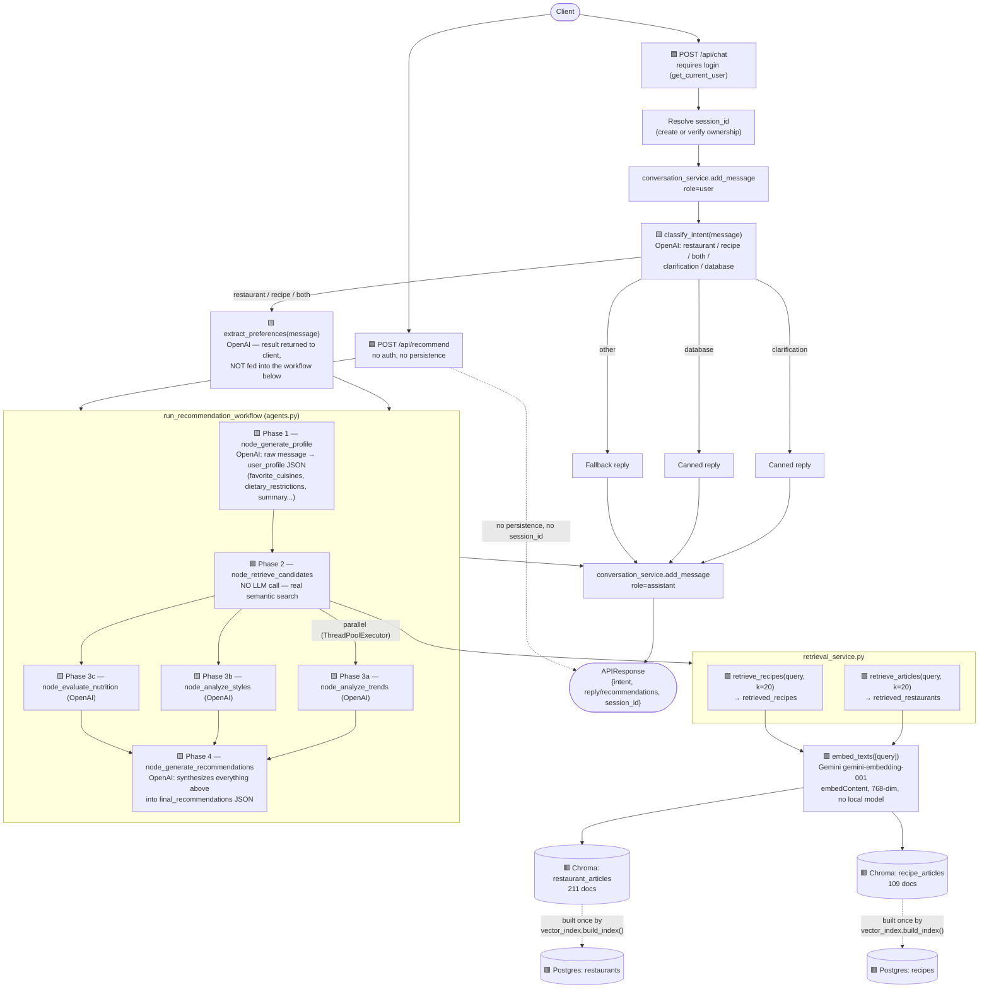

# Recommendation pipeline — `/api/chat` and `/api/recommend`

Traced from the actual code as of the retrieval fix (`agents.py`, `retrieval_service.py`, `vector_index.py`). Legend:

- 🟦 API/route layer
- 🟨 LLM call (OpenAI, via `_call_agent` / `classify_intent` / `extract_preferences`)
- 🟩 Real retrieval — no LLM, Chroma vector search
- 🟥 Data store

## Notes on what's real vs. generated

- **Phase 2 (retrieval) is the only non-LLM step in the workflow** — as of this fix, it does real vector search against your actual Postgres-seeded restaurant/recipe data instead of asking the LLM to invent results.
- **Phases 1, 3a–3c, and 4 are all separate OpenAI calls**, each re-serializing a chunk of state into the prompt. A single `/api/chat` request with a food-related intent costs **7 OpenAI calls total**: `classify_intent`, `extract_preferences`, profile, trends, styles, nutrition, final synthesis.
- **`extract_preferences`'s result is computed and returned to the client but never used by the workflow** — Phase 1 independently re-derives its own profile from the raw message. This is a wasted LLM call, not wired to anything downstream (flagged, not yet fixed).
- **Query embedding uses Gemini** (`gemini-embedding-001`, free tier, 768-dim); **generation (classify/profile/trends/styles/nutrition/recommend) still uses OpenAI** (`gpt-4.1-nano`) — two different providers for two different jobs.
- **`/api/recommend` skips auth and session persistence entirely** — no `session_id`, no message history saved, unlike `/api/chat`.
